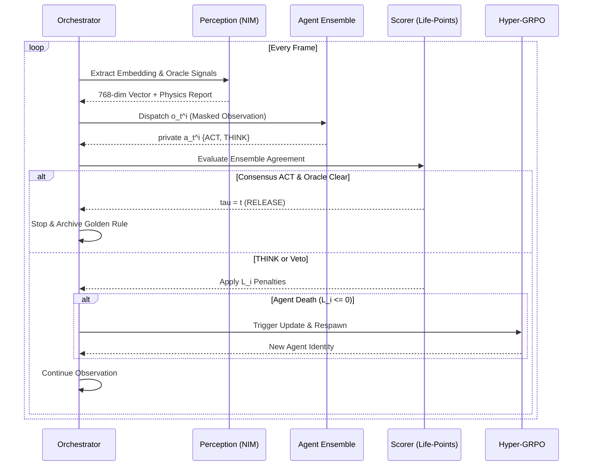
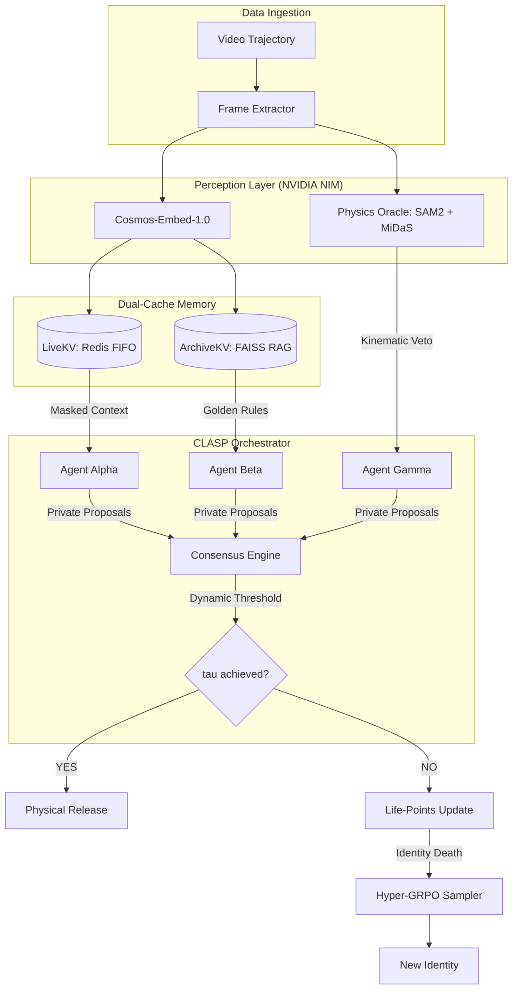

# CLASP: Consensus-based Life-points Agent Stopping-time POMDP

[](https://www.python.org/downloads/release/python-3120/)
[](https://build.nvidia.com/)
[](https://redis.io/)
[](https://opensource.org/licenses/MIT)

## Overview

**CLASP** (Consensus-based Life-points Agent Stopping-time POMDP) is a high-fidelity research framework for **safety-critical robotic manipulation**. It specifically addresses the **Human-to-Robot Object Handoff** problem by reformulating the release decision as a stopping-time policy within a Partially Observable Markov Decision Process (POMDP).

Unlike standard classification models, CLASP employs an **ensemble of epistemically independent agents** that operate under varying degrees of information asymmetry. These agents participate in a **competitive survival game** where incorrect decisions lead to "death" and subsequent replacement via **Hyper-GRPO** (Group Relative Policy Optimization).

### The Core Idea: Epistemic Independence
In safety-critical systems, correlated failure is the primary enemy. CLASP forces agents to be "blind" to one another's internal states and decisions, ensuring that a consensus `ACT` (Release) command reflects a robust alignment of diverse physical evidence rather than a shared hallucination.

---

## Architecture & Mechanisms

### 1. The Stopping-Time POMDP
The physical state $s_t$ (grip stability, hand-gripper distance, velocity gradients) is latent. The orchestrator must find the optimal stopping time $\tau$ to commit to the physical release primitive.



### 2. Information Asymmetry Matrix (P x T x M)
To prevent correlated errors, every agent is assigned a unique identity from a 36-combo matrix:
- **P (Prompt Bias)**: Ranging from *Conservative Safety* to *Kinematic Skeptic*.
- **T (Temporal Stride)**: Controls the granularity of historical context from `LiveKV`.
- **M (Modality Mask)**: Restricts the agent's focus to specific feature subspaces (e.g., *Gripper-only* or *Velocity-only*).

### 3. Survival Dynamics: The Life-Points (L_i) Game
Agents are incentivized for both safety and decisiveness through a non-linear penalty structure:
- **THINK (Defer)**: Small constant drain ($\gamma_{think}$). Prevents infinite stalling.
- **Wrong ACT (Premature)**: Massive penalty ($\gamma_{wrong}$). 
- **Early Wrong ACT**: Double penalty ($2\gamma_{wrong}$). Fatal to most identities.
- **Correct ACT**: Full health restoration ($L_{max}$).

### 4. Dual-Cache Memory System
- **LiveKV (Redis)**: A sliding-window FIFO buffer providing short-term temporal continuity.
- **ArchiveKV (FAISS)**: A vector-indexed long-term memory that retrieves "Golden Rules" (distilled reasoning) from successful historical releases.

---

## System Design



---

## Quick Start

### 1. Environment Setup
```bash
# Clone the repository
git clone https://github.com/AmeerJ97/Nvidia-cosmos-cookoff.git
cd Nvidia-cosmos-cookoff

# Install dependencies
pip install -r requirements.txt

# Start Redis (Required for LiveKV)
docker-compose up -d redis
```

### 2. Configuration
Ensure your `configs/settings.py` is configured with your **NVIDIA NGC API Key**. CLASP leverages `cosmos-reason2-8b` for agent reasoning and `cosmos-embed-1.0` for memory retrieval.

### 3. Execution
```bash
# Run the full CLASP evaluation suite
python run_clasp.py --data data/manifest_20.json
```

### 4. Monitoring
Launch the real-time telemetry dashboard to visualize agent health, consensus entropy, and GRPO policy shifts:
```bash
python dashboard/app.py
```

---

## Evaluation & Rigor

CLASP is evaluated on kinematic stability across thousands of human-to-robot trajectories. We use `pytest` to verify the internal logic of the policy updates and consensus thresholds.

```bash
pytest tests/
```

### Key Performance Metrics
- **Success Rate**: % of correct releases within the ground-truth safe interval.
- **$\Delta \tau$**: Mean temporal deviation from the optimal release frame.
- **Identity Survival Rate**: Mean frames-survived per epistemic identity.

---

## Limitations & Intellectual Honesty

- **Latency**: Multi-agent VLM consensus introduces a 200-500ms lag, making it unsuitable for sub-10ms reactive control without local quantization.
- **Oracle Dependency**: The Physics Oracle (SAM2) requires clear visual line-of-sight to the gripper-object interface.
- **State Drift**: Hyper-GRPO assumes the optimal identity distribution is stationary; non-stationary environments may require a higher learning rate.

---

## License
This project is licensed under the MIT License. Developed for the NVIDIA Cosmos Cookoff.
